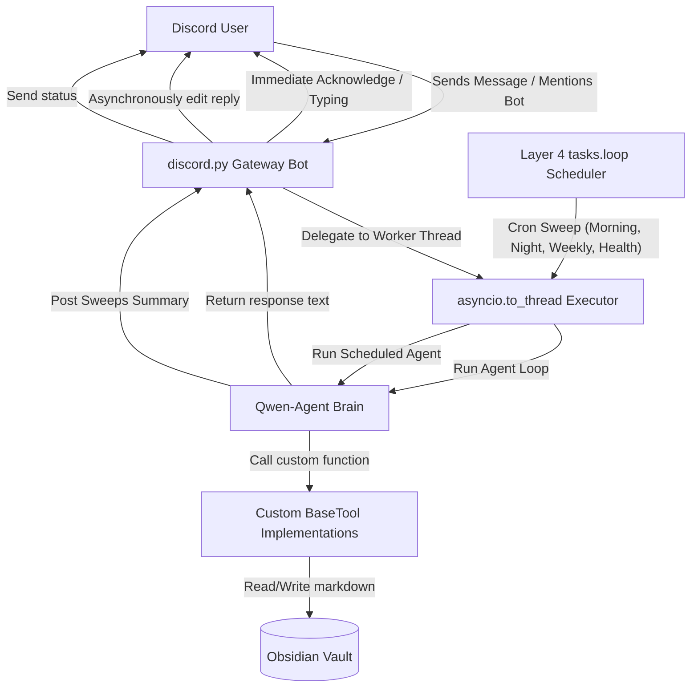

# VagueBotMk3 — Always-On Obsidian Second Brain Discord Partner

VagueBotMk3 is a stateful, "Always On" Discord bot that acts as an autonomous knowledge partner. It integrates `Qwen-Agent` with an Obsidian Vault, utilizing custom tools to maintain and compound your second brain based on Discord conversation and background scheduling.

---

## 🧠 System Architecture



---

## ✨ Features

### 1. Multi-Channel Discord Gateway
- **Intelligent Listening**: Operates across the entirety of your Discord server. It stays polite and silent during general discussions, responding only in Direct Messages (DMs) or when explicitly mentioned (`@bot`).
- **Immediate Acknowledgment**: Instantly sends a typing indicator and placeholder message so you know your vault context is loading.
- **Worker Thread Execution**: Offloads the heavy LLM tool-calling generator onto background threads to keep the Discord WebSocket connection active and prevent timeouts.

### 2. Custom Obsidian Tools (`obsidian_tools.py`)
- **`vault_read_file`**: Reads note contents relative to the vault root.
- **`vault_write_file`**: Enforces strict **AI-First Vault Rules** (checks for YAML frontmatter, `ai-first: true`, valid `date`, `tags`, and a `## For future Claude` preamble). If formatting is incorrect, it returns validation errors so the model can self-repair.
- **`vault_search`**: Title-based and content-based keyword search (capped at 20 results).
- **`vault_list_files`**: Lists markdown files in target folders while excluding system paths.
- **`vault_health_check`**: Runs structural audits (broken links, empty folders, missing metadata).

### 3. Custom Discord Interaction Tools
- **`discord_list_channels`**: Enables the agent to list all channels in the Discord server.
- **`discord_read_channel_history`**: Reads recent history from other channels (e.g. to import conversations into vault notes).
- **`discord_send_message`**: Dispatches messages to other text channels.

### 4. Layer 4 Scheduled Maintenance (Always On)
Runs silently inside your bot's asyncio loop using `discord.ext.tasks` at local timezone settings:
- **☀️ Morning Sweep (8:00 AM)**: Boots up your day, creates the daily note, checks due tasks, and lists inactive/stale projects.
- **🌙 Nightly Close (10:00 PM)**: Appends a 3-5 bullet point End-of-Day summary to today's daily note and cleans up completed board tasks.
- **📅 Weekly Review (Fridays 6:00 PM)**: Compiles achievements, decisions, and lessons into `Reviews/YYYY-MM-DD — Weekly Review.md`.
- **🔍 Health & Contradiction Sweep (Sundays 9:00 PM)**: Runs audits and sweeps for conflicting knowledge claims.
- **Log Dispatching**: All background summaries are written to the vault and duplicated to your server's `#vault-logs` channel.

---

## 🚀 Local Installation & Setup

### 1. Prerequisites
Ensure you have Python 3.10+ installed and your local Ollama server running.

Pull the recommended Qwen Coder model (optimized for tool calling and reasoning):
```bash
ollama pull qwen2.5-coder:7b
```

### 2. Install Dependencies
```bash
pip install discord.py python-dotenv requests json5 pydantic openai tiktoken pillow
```

### 3. Setup Configuration
Copy `.env.example` to `.env`:
```bash
cp .env.example .env
```
Fill out the variables in `.env`:
- `DISCORD_TOKEN`: Your Discord Bot Token (ensure **Message Content Intent** is toggled ON in the Discord Developer Portal).
- `DISCORD_LOG_CHANNEL_ID`: Copy-paste the ID of your `#vault-logs` Discord channel.
- `VAULT_PATH`: Absolute path to your Obsidian vault directory (e.g., `C:/Users/Suici/Documents/VagueBotMk3`).
- `LLM_PROVIDER`: `openai`
- `LLM_API_BASE`: `http://localhost:11434/v1` (Ollama's local endpoint)
- `LLM_MODEL`: `qwen2.5-coder:7b` (or whatever model you pulled)

### 4. Run the Bot
```bash
python discord_agent_bot.py
```
Once online, the bot will post a message in your Discord logs channel and start responding to messages.

---

## 🔒 Token Security
The `.env` file containing your Discord bot token and private directories is listed in `.gitignore` and **will never be committed** to your public Git repository. Only keep `.env.example` committed as a setup template.
